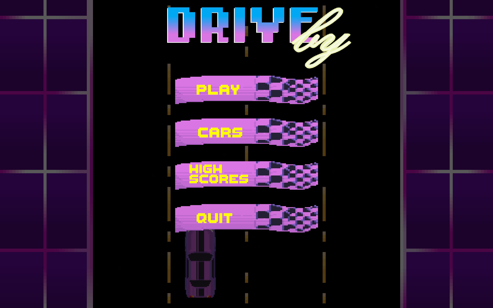
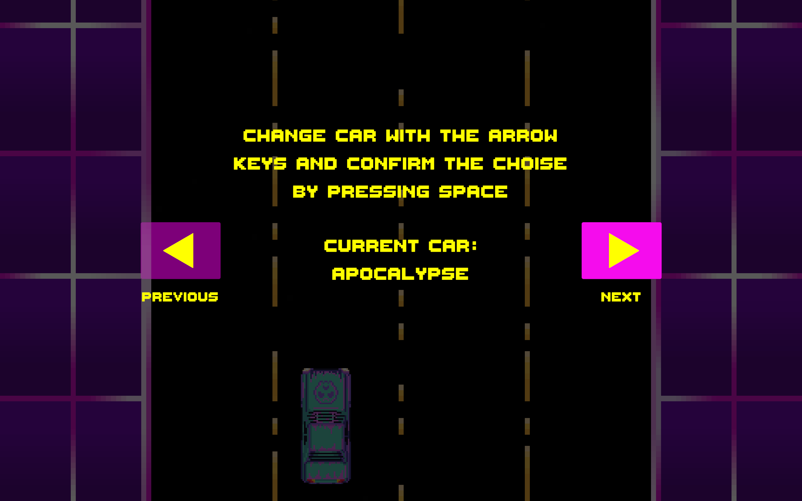
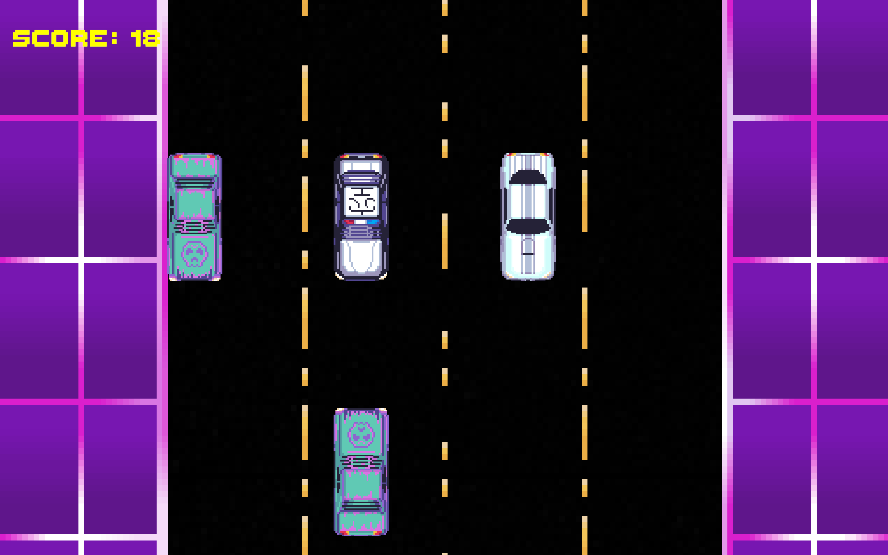

# 🚗 DriveBy

**DriveBy** is a simple, retro-themed game where the goal is to dodge cars driving towards you. The speed of the cars gradually increases, making it more challenging as you try to survive for as long as possible. The game captures the essence of classic arcade games with its fast-paced action and simple mechanics.

---

## 🎮 Gameplay

The objective of **DriveBy** is simple: **dodge the oncoming cars** for as long as you can. The longer you survive, the faster the cars will move, testing your reflexes and decision-making.

### Features:

- **Retro arcade theme**: Inspired by old-school arcade games, featuring simple, fast-paced gameplay.
- **Multiple choosable cars** Pick your favorite
- **Increasing difficulty**: Cars move faster as time goes on, adding to the challenge.
- **Simple controls**: Move left and right to avoid the oncoming cars.

---

## 🛠 Tech Stack

- **Game Engine**: Unity
- **Language**: C#
- **Platform**: PC (Windows)

---

## 📌 Project Info

- **Built in a summer game development camp** as part of a small group project
- The goal was to create a fun, challenging game that catches the feeling of classic arcade games
- Designed for short, intense play sessions where players can test their reflexes and try to achieve the highest score

---

## 📸 Screenshots

  
  
  

---
